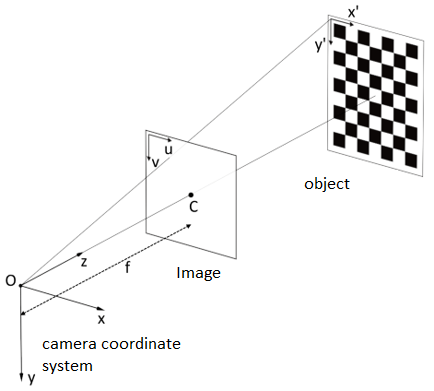
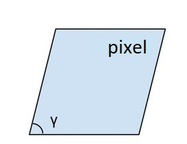
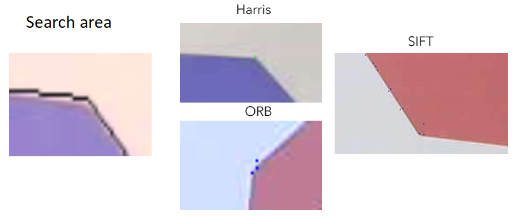
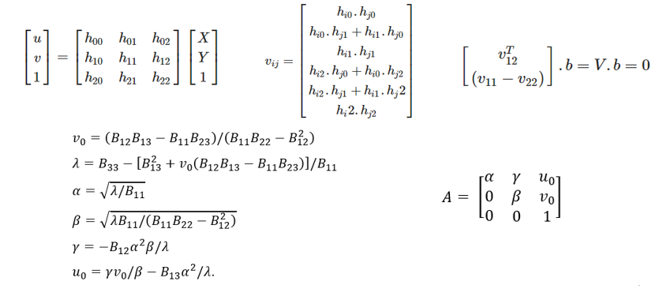
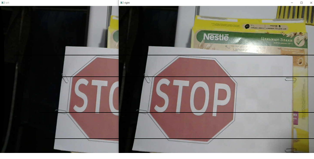

## cameraCalibration
###### Solving the problem of calibrating the camera of a mobile robot in the "field" conditions using the libraries torch, OpenCV, etc.
Camera calibration implies finding internal (camera focus f in pixel dimensions and its skew γ) and external camera parameters.

 

There are currently 4 ways to calibrate the camera:
1. Photogrammetric calibration
    The use of a voluminous or more often flat pattern.
2. Self-calibration
     Photographing the scene from different angles and filtering special points.
3. Calibration using a collimator
    Rarely used, because it involves the use of a special laboratory and expensive equipment for calibration.
4. Calibration using neural networks
    Gives a large calculation error.

To solve the problem, method 1 was chosen, since it is more reliable than self-calibration and more accurate than neural networks. Among the shortcomings, one can note the particularity of the choice of object for each robot.
AprilTag calibration exists and can be used by placing tags on the robot. But in a mobile robot, the cameras are located in the nose, so there is no way to calibrate using them.
Solution steps:

1. Determining the calibration object in the video stream using YOLOv3 and coco dataset and saving the frame (at least two frames are required)
2. Image filtering to find key points
    
    The study showed that the most accurate angle detector is *Harris* in the illumination range *>200lx*. The X and Y coordinates are located at the corners of the STOP sign, the origin is at any corner, the axis Z = 0.

3. Using Zhang's method to find the internal parameters of the camera.
    Brief excerpts. A - matrix of internal parameters. α and β - focus horizontally and vertically, respectively; u_0 and v_0 - optical center of the image; γ - pixel skew.
    

The points can be located in such a way that when solving the system using the SVD method, a division by zero will occur when calculating the internal parameters. Therefore, it is better to use the standard *CalibrateCamera* function in OpenCV. Although it will give erroneous results in the case when it is not possible to solve using SVD.

Having found the internal parameters, you can programmatically calibrate the stereo pair

