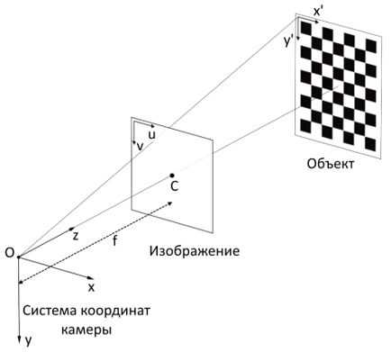
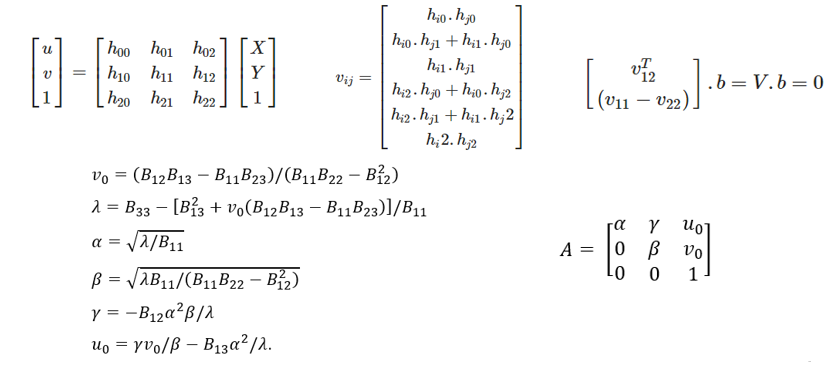

## cameraCalibration
###### Решение задачи калибровки камеры мобильного робота в "полевых" условиях с использованием библиотек torch, OpenCV и др.

Калибровка камеры подразумевает собой нахождение внутренних (фокус камеры f  в размерах пикселя и его перекос γ) и внешних параметров камеры.

 

На данный момент существует 4 способа откалибровать камеру:
1. Фотограмметрическая калибровка
   Использование объемного или чаще плоского паттерна.
2. Самокалибровка
    Фотографирование сцены с разных сторон и фильтрация особых точек.
3. Калибровка с использованием коллиматора
   Используется редко, потому что предполагает собой задействование специальной лаборатории и дорогостоящего оборудования для калибровки.
4. Калибровка с использованием нейронных сетей
   Дает большую погрешность вычислений.

    
Для решения задачи был выбран 1 способ, тк он более надежен, чем самокалибровка и более точен, чем калибровка нейросетью. Из недостатков можно отметить частность выбора объекта для каждого робота.
Калибровка с помощью AprilTag существует и ее можно использовать, если разместить метки на роботе. Но в мобильном роботе камеры распологаются в носовой части, поэтому нет возможности калиброваться по ним.

Этапы решения:
1. Определение калибровочного объекта в видеопотоке с помощью YOLOv3 и coco датасета и сохранение кадра (необходимо минимум два кадра)
2. Фильтрация изображения для поиска особых точек
   
   Исследование показало, что наиболее точный детектор углов *Harris* в диапазоне освещенности *>200лк*. Координаты X и Y расположены по углам дорожного знака STOP, начало координат в любом углу, ось Z = 0.

3. Методом Чжан Ченью нахождение внутренних параметров камеры.
   Краткие выкладки. А - матрица внутренних параметров. α и β - фокус по горизонтали и вертикали соответственно; u_0 и v_0 - оптический центр изображения; γ - перекос пикселя.
   

Точки могут располагаться так, что при решении системы методом SVD разложения возникнет деление на ноль при вычислении внутренних параметров. Поэтому лучше использовать стандартную функцию *CalibrateCamera* в OpenCV. Хотя и она даст ошибычные результаты в случае, когда не удается решить с помощью SVD.

Найдя внутренние параметры, можно программно откалибровать стереопару
 
